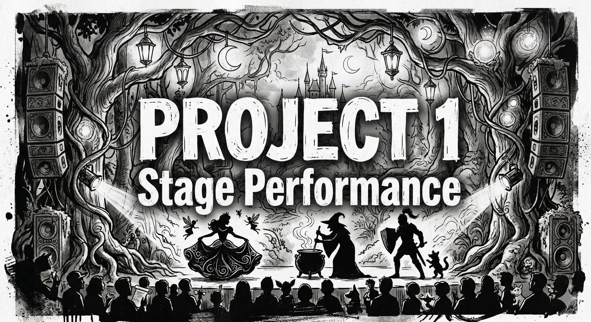
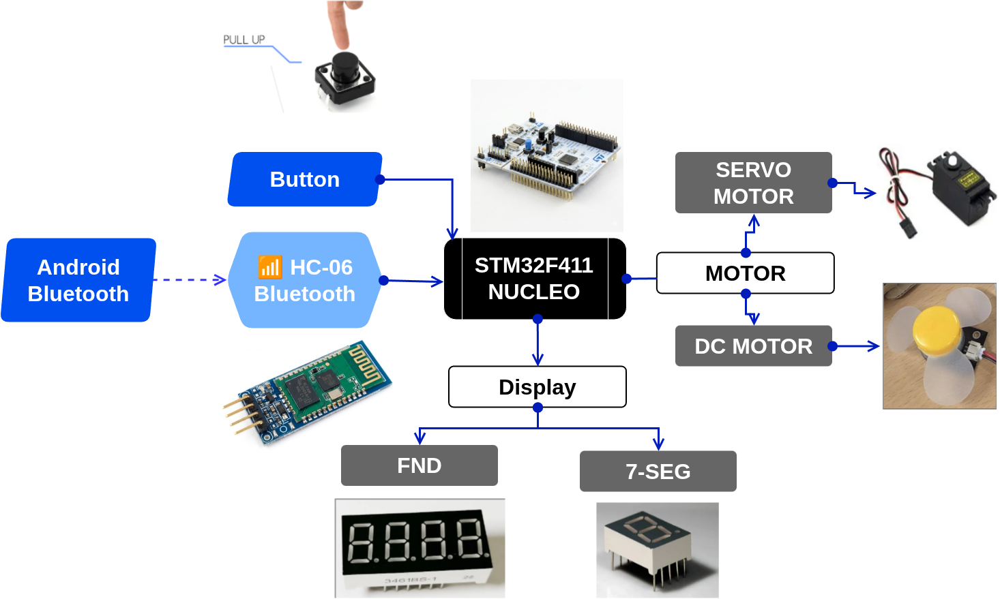
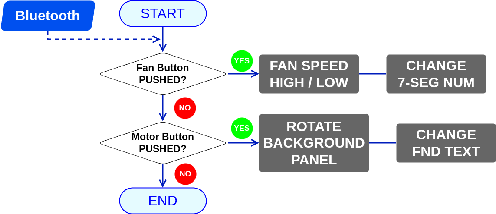
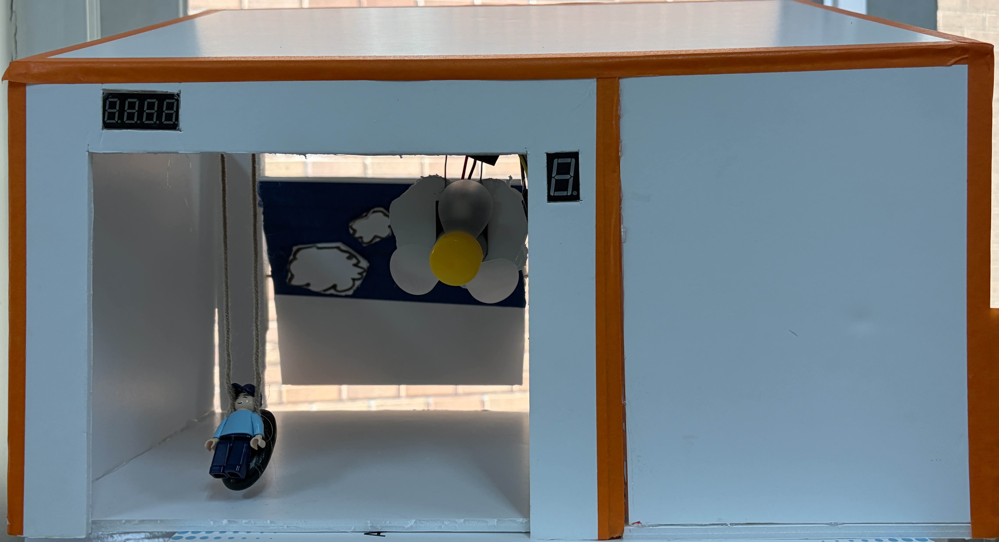
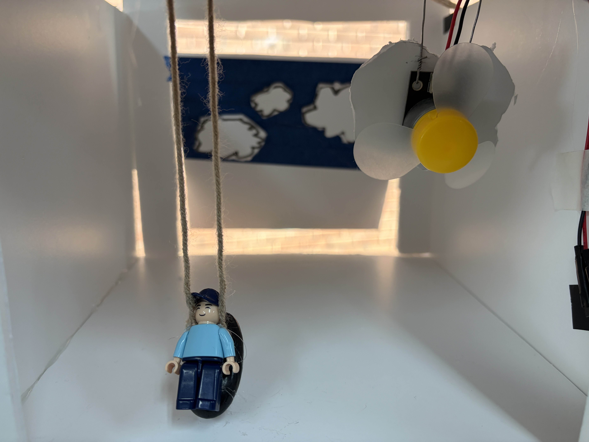
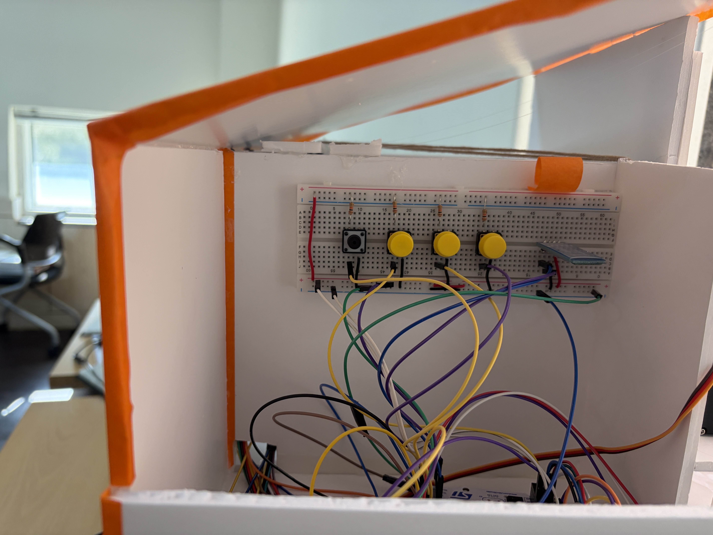

# 💃  Project 1 Stage Performance

## **1. Project Summary (프로젝트 요약)**
STM32(MCU)를 활용하여 무대 공연 장치들을 제작


## 2. Key Features (주요 기능)

- 서브모터를 통하여 무대의 배경을 전환
- 선풍기 모듈을 통하여 무대의 바람을 연출
- FND를 통해 "DAY1"같은 문구로 날짜를 표현
- 7-SEG를 통해 바람의 세기를 표현
- 버튼과 블루투스를 통하여 무대 장치를 제어


## 🛠 3.  Tech Stack (기술 스택)


### 3.1 Language (사용언어)


### 3.2 Development Environment (개발 환경)
| IDE | Configuration |
| :---: | :---: |
|  |  |
| **STM32CubeIDE** | **STM32CubeMX** |

### 3.3 Collaboration Tools (협업 도구)


## 📂 4.  Project Structure (프로젝트 구조)

### 4.1 Project Tree (프로젝트 트리)

```
Project 1 Stage Perfomance/
├── Core/
│   ├── Inc/                     # 각 소스 모듈에 대응하는 헤더 파일 (.h)
│   └── Src/                     # 프로젝트 핵심 로직 구현부 (.c)
│       ├── main.c               # 주변장치 초기화 및 전체 시스템 제어 루프
│       ├── rotate.c             # 서보 모터 회전 및 각도 제어 알고리즘
│       ├── button.c             # 사용자 버튼 입력 감지 및 모드 전환 로직
│       ├── led.c                # 기기 상태 표시를 위한 LED 제어
│       ├── tim.c                # 모터 제어용 PWM 신호 생성을 위한 타이머 설정
│       └── usart.c              # 데이터 송수신을 위한 시리얼 통신(UART) 설정
│
├── images/                      # 프로젝트 시연 이미지 및 기술 문서 리소스
├── Project1.ioc                 # STM32CubeMX 하드웨어 구성 및 핀 배치 설계도
└── README.md                    # 프로젝트 전체 가이드 문서
```


### 4.2 Hardware BlockDiagram (하드웨어 블록다이어그램)



### 4.3 FlowChart (순서도)



## 🏝️ 5. Final Product & Demonstration (완성품 및 시연)

### 5.1 Final Product (완성품)
<br>


|**무대 전체 샷 (Full Setup)** |
| :---: |
| |


| **무대 내부 (Inner)** | **무대 제어부 (Side)** | 
| :---: | :---: |
|  |   | 


<br>


### 5.2  Demonstration (시연 영상)

<a href="https://youtu.be/8-iijkoDCPc?si=8JkFLacraABops5g" target="_blank">
  
</a>

*이미지를 클릭하면 시연 영상(유튜브)로 이동합니다.*


## 6. Troubleshooting (문제 해결 기록)

<details>
<summary> <b> FND 출력 문제 </b></summary>

<br>

🔍  **Issue (문제 상황)**

FND의 출력이 서브모터가 작동중이면 제대로 **"DAY1"** 출력이 되지 않음

❓ **Analysis (원인 분석)**

FND는 아주 빠른속도로 4개의 출력을 연속으로 해서 동시에 켜지는것처럼 보이게 하는데
이것이 Polling 방식이라 서브모터의 동작과 충돌을 일으킴


❗ **Action (해결 방법)**

 FND작동을

✅ **Result (결과)**

센서 데이터의 값이 오버해서 차량이 오작동하는 일이 없어짐

</details>


<details>
<summary> <b> 장애물 회피 시 방향 결정 알고리즘의 불안정성 (Left-Right Misjudgment) </b></summary>

<br>

🔍  **Issue (문제 상황)**

자율 주행 모드 주행 중, 우회전해야하는 상황에서 좌회전을 하는 등 오판을 함

❓ **Analysis (원인 분석)**

정면 거리 측정 후 좌우 공간을 순차적으로 판단하는 우선순위 기반 로직의 특성상, 공간이 급격히 좁아지는 **코너 구석(Corner Nook)** 진입 시 측면 데이터를 충분히 반영하지 못하는 오판 현상이 발생함.

❗ **Action (해결 방법)**

왼쪽 중앙 오른쪽 모든 센서의 거리중에서 가장 짧은 거리를 선별하여 그 쪽을 우선하여 회피하도록 로직을 수정

✅ **Result (결과)**

좌우판단을 더 이상 오판하지 않음
</details>

<details>
<summary> <b> 넓은 코너에 진입하면 갇힘 (Get trapped in Wide Corner) </b></summary>

<br>

🔍  **Issue (문제 상황)**

좌우가 넓은 코너에 코너 안쪽으로 비스듬하게 진입시 회전 판단을 미리 못하여 벽에 부딛힘

❓ **Analysis (원인 분석)**

코너의 폭이 넓기 때문에 측면 센서가 인식하기에 거리가 너무 멀어서 정작 정면 센서쪽이 한계거리에 도달해도 회피판단을 못함

❗ **Action (해결 방법)**

Crash_Distance란 변수를 추가하여 정면센서가 이 거리에 도달하면 강제 후진 로직을 최우선으로 올림
후진이후 강제로 회전하면서 좌우 센서값을 강제로 갱신시킴
이후 회피판단로직 실행

✅ **Result (결과)**

넓은 코너에서 더 이상 갇히는 일이 없어짐

</details>


